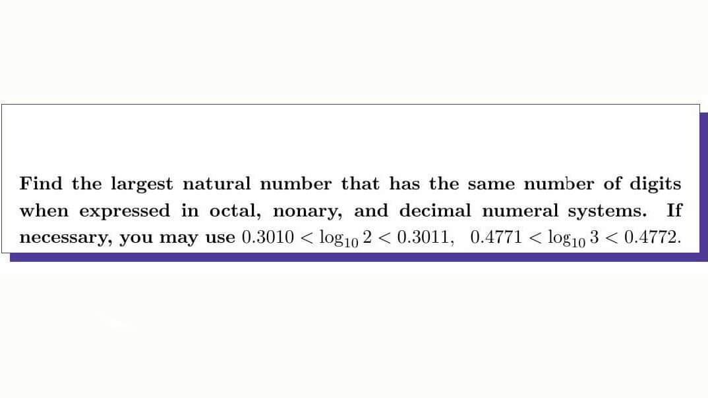

# Numeral System challenge

## Credit

   - [Original FB post](https://www.facebook.com/share/p/2FwfvP7MVAsU1Lqa/?mibextid=oFDknk)

## Problem statement

<p align="center"></p>

## Source code

```d
import std.stdio: writeln, writefln;
import std.conv: to;
import std.range: replicate;

void main() {
    string octalString;
    string decimalString;
    string nonaryString;
    
    long n;
    
    long i = 1;
    
    while (true) {
        octalString = "7".replicate(i);
        n  = to!long(octalString, 8);
        
        if (to!string(n).length != i || to!string(n, 9).length != i) {
            octalString = "7".replicate(--i);
        
            break;
        }
        
        ++i;
    }
    
    decimalString = to!string(to!long(octalString, 8));
    nonaryString  = to!string(to!long(octalString, 8), 9);

    writeln("\nAnswer:");
    writeln;
    writefln("Octal   : %s", octalString);
    writefln("Decimal : %s", decimalString);
    writefln("Nonary  : %s", nonaryString);
    
}
```
## Output

```text
Answer:

Octal   : 7777777777
Decimal : 1073741823
Nonary  : 2684381780
```
